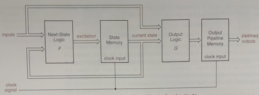
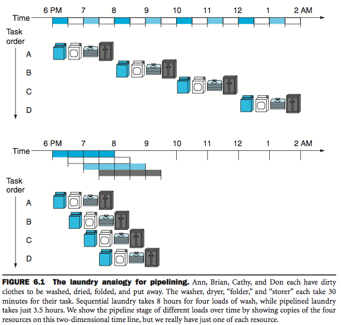

## Pipelining
===========

Design a state machine so that the outputs during one clock period depend on the state and inputs during the _previous_ clock period.

- one additional logic (flip-flops) is attached to the output
- usable only if you know the desired next output value one clock period _in_ _advance_
    - because your next input could depend on it!

### From computer architecture

"like a assembly line."

Pipelining is an implementation technique in which multiple instructions are overlapped in execution.

#### Pipeline hazards
