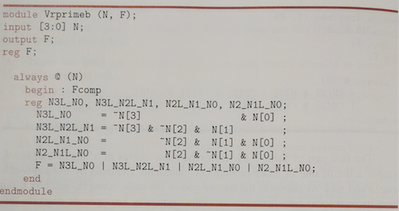

## Verilog
==========

#### What for

Behavioral descriptions => logic-circuit structures

### Module
***
- Basic unit in Verilog, containing:
- declarations
    - names and types of inputs and outputs
    - local signals, variables, constants and functions only valid inside the module
    - values could only be passed between modules by i/o
- statements
    - specify operations of the module internally
    - behavior: such as assigning values to signals based on conditions
    - structural: initialize more modules and define their interconnections
- modules behave hierarchically

### Signals
***
- 4 types of possible values: 0, 1, x (unknown), z (high impedance, as in three-state)
- operators: &, |, ^, ~ (XOR), ...
- two types of signals: nets, variables

#### net
- similar to a wire in physical circuit
- provides connectivity between modules, such as i/o ports
- net declaration example: wire identifier, identifier,...
- type wire: any i/o port without specific declaration
- type supply0, supply1: ground and constant-1 signals
- type tri

#### variable
- only used in “procedural code”, does not need to be in physical circuit
- common types: reg and integer
- reg: to store values
- integer: for control, such as for loop
- net or variable?
- variables cannot be changed outside of the module => input/inout ports cannot be variables
- procedural code could assign values to only variables
- literals
- direct digits => decimal numbers
- n’Bddd…d
    - n: # of bits of the literal, not # of digits
    - B: base, b (binary), o (octal), h (hexadecimal), d (decimal)
    - d: each single digit in the specified base

### Vectors&Arrays
***
- vector: group of individual 1-bit signals: nets, variables, constants
- bit select [1], part select [5:4], concatenate {}, replicate n{}
- padding
- array: mostly reg and integer
- vector or array?

### Structural design elements
***
- this and following two are concurrent statements: be executed simultaneously in the same module
- structural: instantiate and connect different gates and components using nets
- built-in gates: and/nand, or/nor, xor/xnor, not/buf and 1-input three-state 

- two ways of stating instance
    - component instance-identifier (expr, expr, ..., expr);
        - `not U3 (notinh2, inh2);`
        - in this way the order of port name matters: `output, input, input, ...`
    - component instance-identifier (.port-name(expr), ..., .port-name(expr)); 
        - `VrInh U1 ( .out(inh1), .in(in1), .invin(in2) );`
- All instance statements in the figure are execture _concurrently_
- different order of statements result in the same circuit

### Dataflow design elements
***

Describe the flow of data and operations on the circuit for **combinational circuit**.

- `assign name = expr;`
- dataflow code for a prime-number detector
- use bitwise-boolean operators instead of gates and connections to implement the equations

- conditional operator `?:` oeprates like a _2-ipnut_ _multiplexer_

### Behavioral design elements (procedural code)
***

#### always block

- two types of _procedural_ assignment statements
    - `var = expr ; // blocking`
        - generally the same as assignments in other languages
        - [rule] always use to create **combinational** logic
    - `var <= expr ; // nonblocking`
        - only assign the value of righthand side evaluation to left side after the entire block has been executed.
        - during the _always_ block, the `var` holds the old value
        - [rule] always use to create **sequential** logic

- declare `F` as `reg` because it appears on the lefthand side of an assignment statement
- one-line block, no intermediate vars
- need `begin-end` block for intermediate variables

- similar to the dataflow code, but use _always_ block
- intermediate signals are `reg` within the block
- `begin-end` block must be named if it contains intermediate signals
