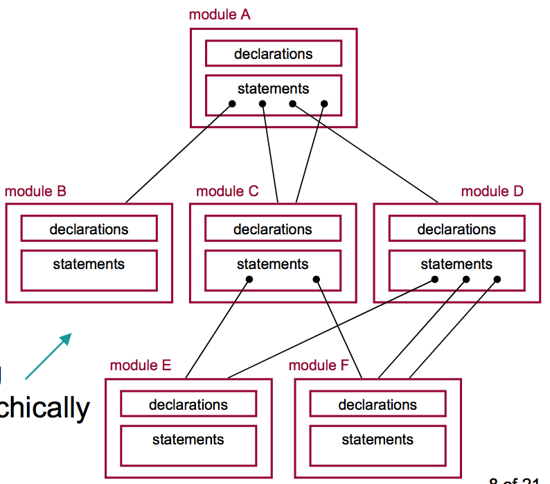

## Verilog
==========

#### What for

Behavioral descriptions => logic-circuit structures

### Module
***
- Basic unit in Verilog, containing:
- declarations
    - names and types of inputs and outputs
    - local signals, variables, constants and functions only valid inside the module
    - values could only be passed between modules by i/o
- statements
    - specify operations of the module internally
    - behavior: such as assigning values to signals based on conditions
    - structural: initialize more modules and define their interconnections
- modules behave hierarchically

### Signals
***
- 4 types of possible values: 0, 1, x (unknown), z (high impedance, as in three-state)
- operators: &, |, ^, ~ (XOR), ...
- two types of signals: nets, variables

#### net
- similar to a wire in physical circuit
- provides connectivity between modules, such as i/o ports
- net declaration example: wire identifier, identifier,...
- type wire: any i/o port without specific declaration
- type supply0, supply1: ground and constant-1 signals
- type tri

#### variable
- only used in “procedural code”, does not need to be in physical circuit
- common types: reg and integer
- reg: to store values
- integer: for control, such as for loop
- net or variable?
- variables cannot be changed outside of the module => input/inout ports cannot be variables
- procedural code could assign values to only variables
- literals
- direct digits => decimal numbers
- n’Bddd…d
    - n: # of bits of the literal, not # of digits
    - B: base, b (binary), o (octal), h (hexadecimal), d (decimal)
    - d: each single digit in the specified base

### Vectors&Arrays
***
- vector: group of individual 1-bit signals: nets, variables, constants
- bit select [1], part select [5:4], concatenate {}, replicate n{}
- padding
- array: mostly reg and integer
- vector or array?

### Structural design elements
***
- this and following two are concurrent statements: be executed simultaneously in the same module
- structural: instantiate and connect different gates and components using nets
- built-in gates: and/nand, or/nor, xor/xnor, not/buf and 1-input three-state 

